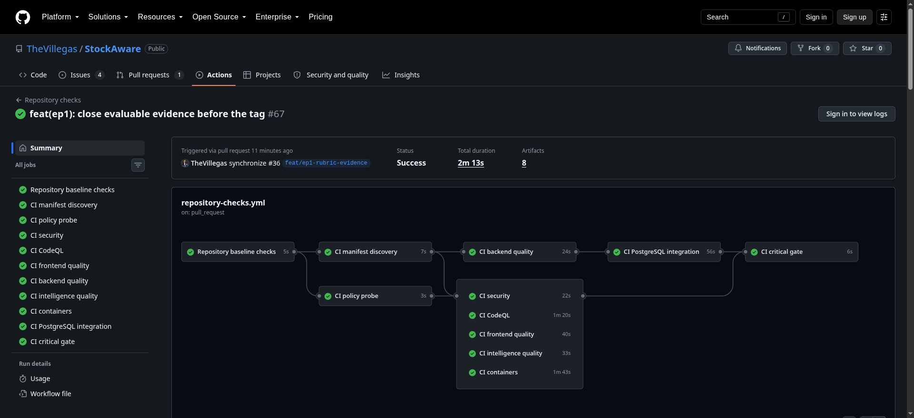
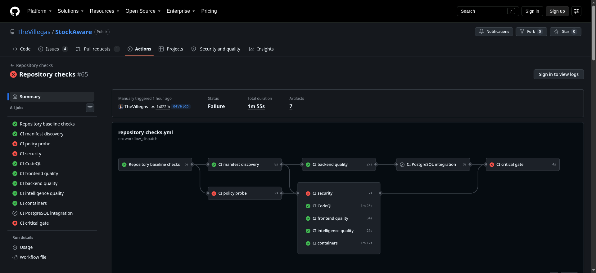
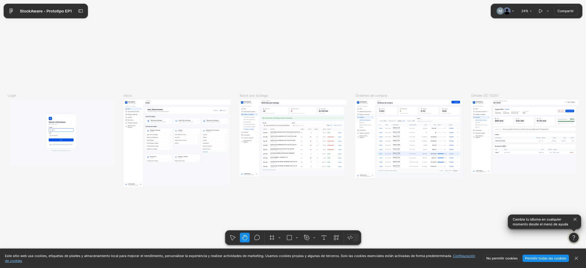

# StockAware

StockAware es un proyecto de Ingeniería Web Avanzada de la Pontificia Universidad Católica de Valparaíso, orientado a mejorar decisiones de inventario MRO —como equipos de protección personal, ropa técnica, insumos y herramientas— mediante información consolidada y recomendaciones explicables de reposición.

**Estado actual:** lo que hoy se puede ejecutar es una réplica funcional del ERP VAIPS con datos anonimizados; no es todavía un producto completo de reposición adaptativa. La visión y el alcance comprobable están diferenciados en el [contexto del proyecto](docs/project-overview.md).

- [Reproducir la demo EP1](docs/ep1/reproducibility.md)
- [Diagramas de arquitectura EP1](docs/architecture/ep1-diagrams.md)
- [Staging preliminar EP1](docs/ep1/staging.md)
- [Configuración inicial de Capacitor EP1](docs/ep1/capacitor.md)
- [Fallo controlado del gate EP1](docs/ep1/controlled-failure.md)
- [Modelo de datos de la réplica](docs/architecture/data-model.md)
- [Prototipo Figma EP1](https://www.figma.com/design/RIvAtOoqdvHUBkURaxOopG/StockAware---Prototipo-EP1?node-id=7-3&t=0dfW1TifAtPN0y98-1)
- [Contribuir al proyecto](CONTRIBUTING.md)

## Evidencia visible de la EP1

Estas capturas acompañan los enlaces. No reemplazan el run ni el prototipo.

Pipeline verde del corte, incluido PostgreSQL, contenedores y el gate crítico. Run: https://github.com/TheVillegas/StockAware/actions/runs/36375148731

Fallo controlado disparado a propósito. Fallan el policy probe y el gate crítico. El job de seguridad también aparece en rojo porque el rango de escaneo quedó vacío, no porque se haya encontrado un secreto. Run: https://github.com/TheVillegas/StockAware/actions/runs/36371534531

Archivo de diseño de Figma, abierto sin contraseña. Muestra login, inicio, stock por bodega, órdenes de compra y el detalle de una OC.

