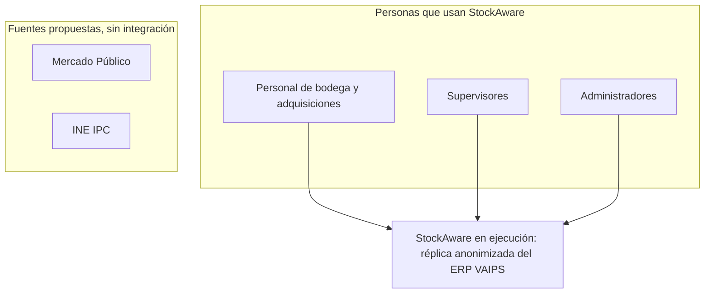
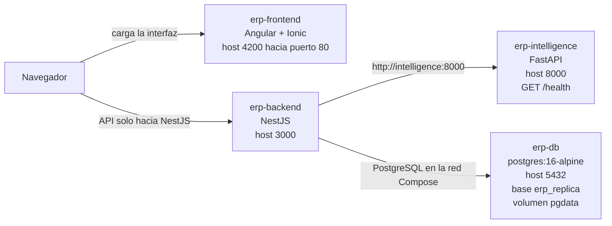
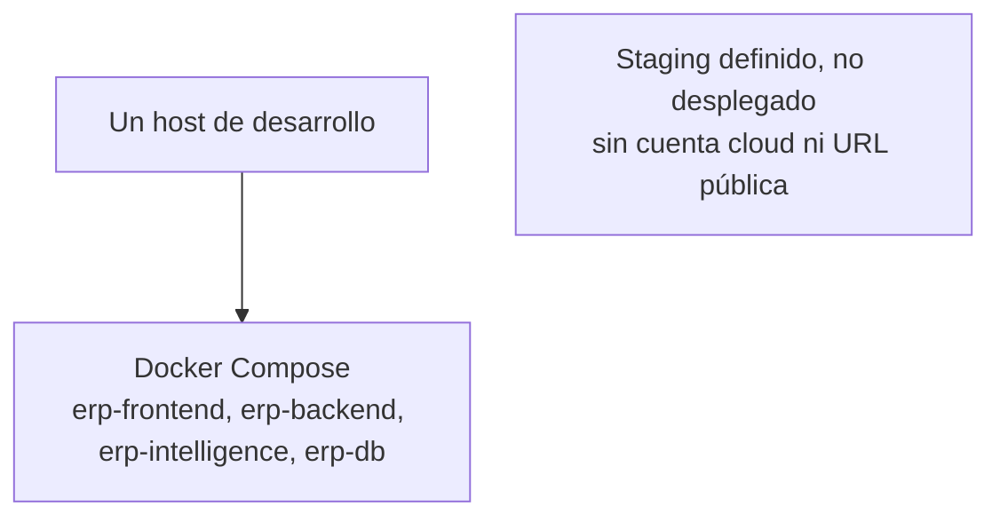

# Diagramas de arquitectura EP1

Estos diagramas describen la réplica que hoy se puede ejecutar, no un producto terminado de reposición adaptativa. El [contexto del proyecto](../project-overview.md) separa esa visión del alcance comprobable. La [guía de reproducibilidad](../ep1/reproducibility.md) detalla puertos, orden de arranque y pruebas locales. No hay enlace de Figma en este documento: todavía no se proporcionó una URL.

## Contexto

StockAware, en la forma que corre ahora, lo usan personas de bodega y adquisiciones, supervisores y administradores. Lo que está en ejecución es una réplica anonimizada del ERP VAIPS. Los perfiles de acceso de esa réplica no significan que cada flujo previsto del producto ya esté implementado.

Mercado Público e INE IPC aparecen solo como fuentes externas propuestas. No están integradas: el diagrama no dibuja una relación con ellas.

No hay flecha desde Mercado Público ni desde INE IPC hacia la réplica. Esa ausencia es intencional.

## Contenedores

El diagrama sigue `docker-compose.yml`. Los puertos de host son los defaults del Compose (`4200`, `3000`, `8000` y `5432`); se pueden cambiar con variables de entorno. El navegador carga la interfaz desde `erp-frontend` y la aplicación Angular + Ionic llama solo a NestJS (`http://localhost:3000/api` en el código del frontend). No hay canal de la aplicación hacia FastAPI ni hacia PostgreSQL.

Compose publica los puertos de FastAPI y PostgreSQL en el host para pruebas locales. Eso no es una dependencia del navegador. El backend, dentro de la red de Compose, usa `http://intelligence:8000`.

`erp-backend` espera a que `db` e `intelligence` estén healthy antes de iniciar. `erp-frontend` declara `depends_on` de `backend`; eso es orden de arranque, no un proxy. `erp-intelligence` expone `GET /health`. `erp-db` usa la imagen `postgres:16-alpine`, la base por defecto `erp_replica` y el volumen `pgdata`. NestJS y el frontend no declaran healthcheck en Compose.

## Despliegue preliminar

Hoy el único entorno que se ejecuta es un host de desarrollo que corre Docker Compose con los cuatro contenedores anteriores. Staging está definido en Terraform y no está desplegado. No hay cuenta cloud, balanceador ni URL pública que este repositorio pueda mostrar.

`ausente` queda sin flecha a propósito: no representa un ambiente creado.
